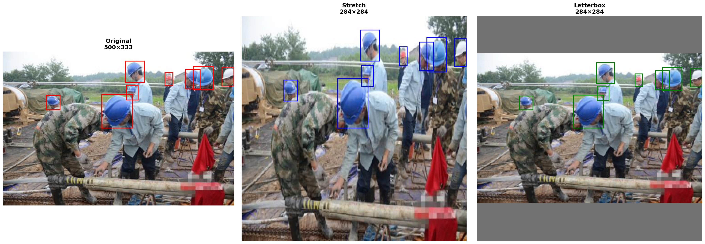

# Image Resize Tool for KITTI Dataset
In this project, I develop a Python tool to resize images and transform [KITTI format](https://docs.nvidia.com/tao/tao-toolkit/text/data_annotation_format.html#object-detection-kitti-format) annotations. It is focused on machine learning pipelines where a specific image size is required.


## Problem Statement

Computer vision models require specific image dimensions. The reality, however, is that real-world project datasets contain images of varying sizes. 

Therefore, image sizing is a crucial step in data preprocessing.

There are several methods for adjusting image size. In this project, I focused on two techniques that don't crop the image, thus avoiding the loss of important information:

### Stretch: 

Directly resizes the image to match target dimensions exactly.

**How it works:**
- Original image: 800×600 pixels
- Target size: 640×640 pixels  
- Result: Image is **stretched/compressed** to fill exactly 640×640

**Visual Effect:**
- **Uses full image area** - no wasted pixels
- **Distorts proportions** - objects appear "squished" or "stretched"
- **Circles become ovals, squares become rectangles**


### [Letterbox](https://medium.com/@reachraktim/letterboxing-in-yolov5-yolov7-yolov8-an-intuitive-explanation-with-python-code-88f7d4323d6c): 

Resizes the image while **preserving original aspect ratio** and fills remaining space with padding.

**How it works:**
- Original image: 800×600 pixels
- Target size: 640×640 pixels
- Calculate scale factor: min(640/800, 640/600) = 0.8
- Resize to: 640×480 (maintains proportion)
- Add gray padding: 80px top and bottom

**Visual Effect:**
- **Preserves proportions** - objects look identical to original
- **No geometric distortion**
- **Unused image area** (gray bars/padding)

Since in computer-vision tasks, maintaining true objects shapes is crucial for detection accuracy, as many popular pipelines as [YOLO](https://medium.com/%40gavin_xyw/letterbox-in-object-detection-77ee14e5ac46) we'll set Letterbox resizing as the default resizing mode.  

##  Installation

```bash
# Clone the repository
git clone <https://github.com/fserra43/ml_resize.git>
cd ml_resize

# Create virtual environment
python -m venv venv
source venv/bin/activate 

# Install dependencies
pip install -r requirements.txt
```

## Usage

### Command Line Interface

The tool comes with sensible defaults that match the technical interview requirements:

**Default Configuration:**
- Input images: `data/images/`
- Input labels: `data/kitti_annotations/`
- Output directory: `results/`
- Target size: `284×284` pixels
- Resize mode: `letterbox`

```bash
# Run with all defaults (processes data/images → results/)
python -m resize.cli

# Specify only what you want to change
python -m resize.cli --mode stretch

# Custom paths and size
python -m resize.cli \
    --in_img data/images \
    --in_lbl data/kitti_annotations \
    --out results \
    --size 284 284 \
    --mode letterbox

# Different target size for ML training
python -m resize.cli --size 640 640

# Stretch mode for faster processing
python -m resize.cli --mode stretch --size 416 416

# Custom image extension
python -m resize.cli --img_ext png
```

**All Available Options:**
```bash
python -m resize.cli \
    --in_img data/images \               # Input images directory (default: data/images)
    --in_lbl data/kitti_annotations \    # Input labels directory (default: data/kitti_annotations)
    --out results \                      # Output directory (default: results)
    --size 284 284 \                     # Target size W H (default: 284 284)
    --mode letterbox \                   # Resize mode: letterbox|stretch (default: letterbox)
    --img_ext jpg                        # Image extension (default: jpg)
```

### Python API

```python
from resize.kitti import load_kitti_labels, write_kitti_labels
from resize.transform import apply_letterbox, apply_stretch
import cv2

# Load image and annotations
img = cv2.imread("sample.jpg")
objects = load_kitti_labels("sample.txt")

# Apply letterbox transformation
resized_img, resized_objects = apply_letterbox(img, objects, 640, 640)

# Save results
cv2.imwrite("resized.jpg", resized_img)
write_kitti_labels("resized.txt", resized_objects)
```

## Visual Demo

See [`demo.ipynb`](./demo.ipynb) for an interactive demonstration comparing stretch vs letterbox methods with real KITTI data.




##  Project Structure

```
├── resize/                # Main package
│   ├── __init__.py        # Package initialization
│   ├── kitti.py           # KITTI format parsing/writing
│   ├── transform.py       # Image transformation functions
│   ├── cli.py             # Command-line interface
│   └── __main__.py        # Module entry point
├── demo.ipynb             # Interactive demonstration
├── requirements.txt       # Python dependencies
├── .gitignore             # Git ignore rules
├── assets/                # Contains README documentation images
└── README.md              # This file
```


